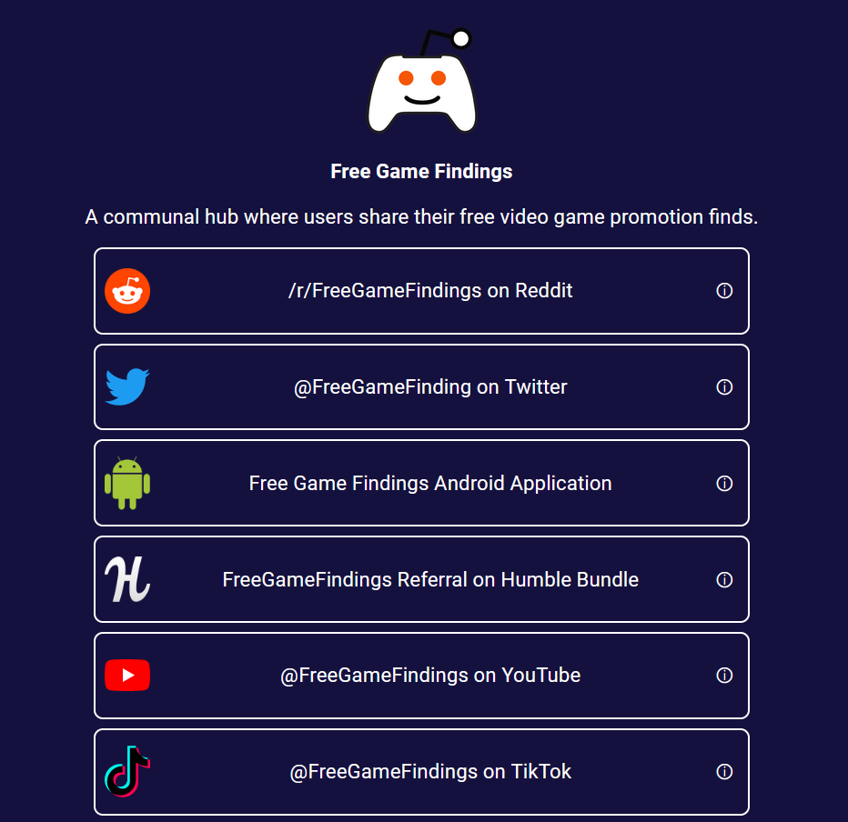

# A linktree alternative for /r/FreeGameFindings
> A list of all the official Free Game Findings links and related platforms with some examples and and direct links to follow. Think a simply LinkTree website, but with included details when possible.
> Feel free to clone this project and change the included content into whatever fits your needs. Please consider Starring this repo if you like! <3

> Template code was used from here. I edited a lot of it since but I figured I should shout it out anyway: https://github.com/alisa-yar/Linktree-Alternative

### Website Preview

  <kbd>
    
  </kbd>

## Tools Used 🛠️
* [<b>GitHub Pages</b>](https://create-react-app.dev/docs/deployment/#github-pages) - To host the static website (HTML, CSS, JS).
* [<b>CloudFlare Pages</b>](https://pages.cloudflare.com/) - Alternative to host the static website (HTML, CSS, JS).

## License 📄
This project is licensed under the MIT License - see the [LICENSE.md](./LICENSE) file for details.
